<div align="center">
  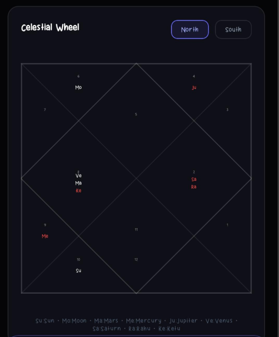
  <h1>✨ Astrology AI Pro</h1>
  <p><strong>A Next-Generation AI-Powered Vedic Astrology & Palmistry Platform</strong></p>

  [](https://react.dev/)
  [](https://reactnative.dev/)
  [](https://expo.dev/)
  [](https://nodejs.org/)
  [](https://expressjs.com/)
  [](https://aistudio.google.com/)
  [](#license)
</div>

<br />

> **Astrology AI Pro** turns the exact sky at your birth into clear, personal guidance. It computes a **Vedic Kundali (birth chart)** to sub-degree precision *on-device*, derives the deterministic Vedic facts (dignities, Dashas, Doshas, Ashtakvarga, Yogas), then hands those facts — never your raw data — to **Google Gemini 2.5** for interpretation. On top of the chart it adds **AI-vision palm reading**, **transit-based daily guidance**, and a **context-aware astrologer chat** — all behind one secure Express API, delivered through a **PWA web app** and a **native iOS/Android app**.

---

## 📑 Table of Contents

- [Features at a Glance](#-features-at-a-glance)
- [Why this project is different](#-why-this-project-is-different)
- [The Four Pillars (Features in depth)](#-the-four-pillars-features-in-depth)
- [Core Features in Action](#core-features-in-action)
- [Deep Dive: The Science & Soul of the App](#deep-dive-the-science--soul-of-the-app)
- [The AI Strategy: Right Model for the Right Job](#-the-ai-strategy-right-model-for-the-right-job)
- [Architecture & Data Flow](#-architecture--data-flow)
- [Tech Stack](#tech-stack)
- [Project Structure](#project-structure)
- [Quick Start](#quick-start)
- [Environment Variables](#environment-variables)
- [API Reference](#api-reference)
- [Data Model](#-data-model)
- [Scripts](#scripts)
- [Deployment Architecture](#️-deployment-architecture)
- [Security Notes](#security-notes)
- [Troubleshooting](#troubleshooting)

---

## ⚡ Features at a Glance

A quick brief on everything the app does — each item is expanded further down.

**Core readings**
- **🪐 Kundali (birth chart)** — sub-degree natal chart computed on-device, plus a full AI reading (life theme, identity, career, relationships, strengths, growth zones, key placements, remedies).
- **✋ Palm reading** — on-device quality gate (MediaPipe Hands) → Gemini Vision per-line analysis; **both-hands** "inborn potential vs. lived reality" comparison.
- **📅 Daily guidance** — transit-mapped reading for any date: Moon house, alignment %, lucky colour/number, auspicious windows, Rahu Kaal — cached per day.
- **💬 AI astrologer chat** — topic-gated, chart-grounded Q&A that remembers prior turns and folds in your latest palm reading; persisted per user.

**Charts & visualizations**
- **Celestial Wheel** (North/South Indian), **Dasha Wheel**, **Ashtakvarga heat-wheel**, **Destiny Matrix** (0–100 life-area scores), **Planetary Strength** meters (Shadbala-lite), and **Panchang** snapshot.
- **🌀 Bi-Wheel Gochar map** *(web + mobile)* — dual wheel of natal vs. live transits with conjunction connectors and **"Active Alignments"**, each with an **"Ask ›"** button that deep-links to chat and auto-asks that exact transit.

**Trust & interactivity ("show your work")**
- **🔎 Show-Your-Work evidence** — every AI section cites the exact placements behind it; palm reading shows **measured** geometry (never model-invented numbers).
- **⏳ Timeline Check** — a grounded past-event yes/no tied to a real dasha window; honest by design and remembered on-device.
- **📊 Prediction Confidence** — how many independent chart signatures back each theme (High = factors agree, not "the AI sounded sure").
- **👆 Interactive planets & dasha** — tap any planet for a detail sheet; expand any forecast window for its *why* + behavioural Do's/Don'ts.

**Platform & system**
- **🔐 Phone-OTP auth** (Firebase) with backend-issued JWTs; **💳 credits + payments** (Razorpay web, native IAP mobile) with an append-only ledger; **🛠 admin back-office** for users, plans, feature costs, and pushes.
- **🔔 Randomised engagement pushes** with a bundled custom notification sound; **🌍 geocoding + IANA timezone** cache; **🎨 dark/light theming** and polished haptics/animations across both clients.

---

## 🌟 Why this project is different

Most astrology apps either (a) hard-code a handful of canned horoscopes, or (b) send your birth data straight to an LLM and let it hallucinate the math. This project does neither.

- **🧮 Real ephemeris, real math.** Planetary longitudes come from [`astronomy-engine`](https://github.com/cosinekitty/astronomy) (NASA JPL-grade), computed **client-side** for zero latency and maximum privacy. The Vedic layer — Lahiri ayanamsha, Whole-Sign houses, Vimshottari Dasha, Ashtakvarga, Shadbala-lite strength, Dosha/Yoga detection — runs as deterministic code, not as a prompt.
- **🔒 The AI sees facts, not you.** The LLM never receives your name plus a vague vibe. It receives a structured **fact sheet** ("9th lord exalted in the 5th, ruling fortune through higher learning") and is instructed to reason in cause → effect.
- **🪞 Honest by design.** A **Prediction Confidence** layer shows how many independent chart signatures support each theme, so "High confidence" means three factors agree — not that the AI sounded sure.
- **📱 Genuinely cross-platform.** One backend, two first-class clients (PWA + native), and an **intentionally duplicated** offline astrology engine so charts compute without a network on both.

---

## 🔱 The Four Pillars (Features in depth)

### 1. 🪐 Kundali — Birth Chart + AI Reading

The flagship experience. From a name, gender, date, time, and birthplace it builds a complete natal chart and a multi-tab dashboard:

- **Birth Chart tab** — Big Three (Sun / Moon / Lagna), Janma Nakshatra, the **Celestial Wheel** (North & South Indian styles), **Dosha** indicators (Mangal, Kaal Sarp, Pitra, Sade Sati), the **Panchang** snapshot (Tithi, Nakshatra, Yoga, Karana, Vaara), and a **Destiny Matrix** of 0–100 life-area scores.
- **Planets tab** — Every graha in both **Sidereal (Vedic)** and **Tropical (Western)** zodiacs, Whole-Sign house placement, dignity (exalted / own / debilitated), retrograde status, and a **0–100 strength meter** per planet.
- **Timeline tab** — The **Dasha Wheel** and **Ashtakvarga Wheel**, the **Bi-Wheel Gochar map** (a dual SVG wheel: inner ring = natal placements, outer ring = live transits, with dashed connectors for transit↔natal conjunctions surfaced as **"Active Alignments"**), a written **Timeline Forecast** of upcoming Mahā/Antardashā windows with tone and dates, the **Prediction Confidence** transparency card, and **Gochar** (live transits, including Sade Sati phase). Each active alignment has an **"Ask ›"** button that deep-links straight into the astrologer chat and auto-asks that exact transit's question. *(Web + mobile.)*
- **Insights tab** — The AI synthesis: a Life-Theme headline, Core Identity, Personality Matrix, Career, Relationships, Strengths, Growth Zones, Key Placements, and modern behavioural **Remedies**.

> Interpretation is generated by **Gemini 2.5 Pro** (`thinkingBudget: 768` — the deepest of any task) from `INTERP_SYSTEM`, the "Master Vedic Astrologer" prompt in [`backend/src/ai/prompts.js`](backend/src/ai/prompts.js).

### 2. ✋ Palm Reading — AI Vision + On-Device Quality Gate

Upload or capture a palm photo and get a structured palmistry reading — with two layers of quality control so the AI never wastes a call on a bad photo:

- **On-device gate first.** A **TensorFlow.js + MediaPipe Hands** model runs *locally* (web and mobile) to reject obviously unusable shots instantly — `not_a_palm`, `back_of_hand`, `blurry`, `too_dark`, `too_far`, `cropped`, `multiple_hands`, `wrong_hand` — each with a friendly retake hint.
- **Server gate second.** A cheap **Gemini Flash** pass (`PALM_GATE_SYSTEM`, `thinkingBudget: 0`) double-checks usability before any expensive Pro call.
- **The reading.** **Gemini 2.5 Pro Vision** returns per-line analysis (Life, Head, Heart, Fate lines, Mount of Venus, Marriage lines), an overall vibe, strengths, watch-outs, practical career/love guidance, and classical palmistry cross-checks.
- **Both-Hands "Full Life Comparison."** A single Pro call (`PALM_BOTH_HANDS_SYSTEM`) reads the **left hand as inborn potential** against the **right as lived reality**, returning a per-hand summary plus an evolution/alignment synthesis — "what you were given vs. what you've made of it."
- **Efficiency built in.** Photos are compressed (≤1024 px, JPEG q0.7) before upload; images are **never stored** — only a SHA-256 hash, used to dedupe and serve cached readings.

### 3. 📅 Daily Guidance — Transit-Aware, Per-Day

Pick any date on the month strip and get a reading mapped to that day's sky against *your* chart:

- Moon transit house, daily **alignment %**, lucky colour & number, auspicious windows, and **Rahu Kaal**.
- Generated by **Gemini 2.5 Pro** (`DAILY_SYSTEM`, `thinkingBudget: 256`) and **cached per user, per date** — a green dot marks days already computed, so revisits are instant and free.
- Mobile can use **live GPS** (via `expo-location`) to localise transit timings to where you actually are.

### 4. 💬 AI Astrologer Chat — Grounded, Topic-Gated, Persistent

A conversational astrologer that stays anchored to *your* chart:

- **Topic gate.** A fast `GUARD_SYSTEM` (Flash-Lite) classifier answers ALLOW / BLOCK first — off-topic questions (general knowledge, coding, third-party readings, NSFW) are politely refused, keeping the Pro model focused.
- **Context replay.** The service groups prior turns by detected topic (career, marriage, health, money, family, timing, travel, education) and replays the most relevant Q&A pairs, so follow-ups feel continuous.
- **Cross-feature awareness.** Your most recent palm reading is folded into the chat context, letting the astrologer reference both chart and hand.
- **One-tap deep-links.** Tapping **"Ask ›"** on a Bi-Wheel transit alignment opens the chat pre-loaded with that exact question and sends it automatically — no typing.
- **Answered by Gemini 2.5 Pro** (`CHAT_SYSTEM`) with a warm, plain-English Vedic persona that handles sensitive questions with care. Every turn is **persisted per user** so history survives reloads and re-installs.

### ➕ Supporting systems

- **🌍 Location & Timezone engine.** City autocomplete is served by the backend from a **MySQL cache first**, falling back to **OpenStreetMap Nominatim** (free, keyless). Each resolved city is enriched with its IANA timezone via `tz-lookup` — correctly handling half/quarter-hour zones (IST +5:30, Nepal +5:45) — then cached permanently.
- **🔐 Phone-OTP auth.** Firebase Phone Auth is the single identity source for both clients; the backend verifies the Firebase ID token with the Admin SDK and issues its own 30-day JWT.
- **🎨 Theming (mobile).** A full dark/light palette system (`ThemeContext` + design tokens) with persisted preference and a `useStyles((c) => …)` factory pattern — no hard-coded colours.
- **🪄 Polished UX.** Haptic feedback, press-scale animations, cross-fade tab transitions, animated splash + login starfields, skeleton loaders, and an Android back-button that returns to the chart instead of exiting.

---

## Core Features in Action

| Feature | Description | Visual |
| :--- | :--- | :--- |
| **Celestial Wheel** | A precise North/South Indian style birth chart visualizing your planetary placements at the moment of birth. |  |
| **Dosha & Yoga** | Automated checks for significant conditions like Mangal Dosha, Kaal Sarp, and Sade Sati with status labels. | 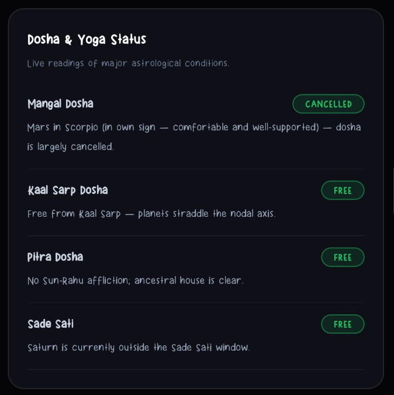 |
| **Panchang Snapshot** | The five vital Vedic time-elements (Tithi, Nakshatra, Yoga, Karana, Vaara) that define your base energy. | 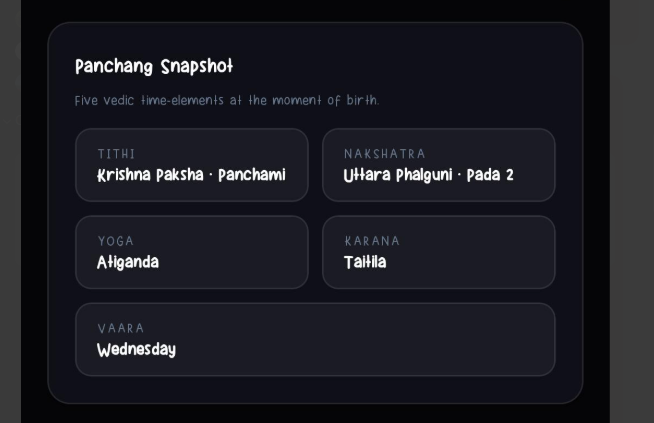 |
| **Destiny Matrix** | Data-driven scores (out of 100) for key life areas like Career, Wealth, and Travel based on house-lord strengths. | 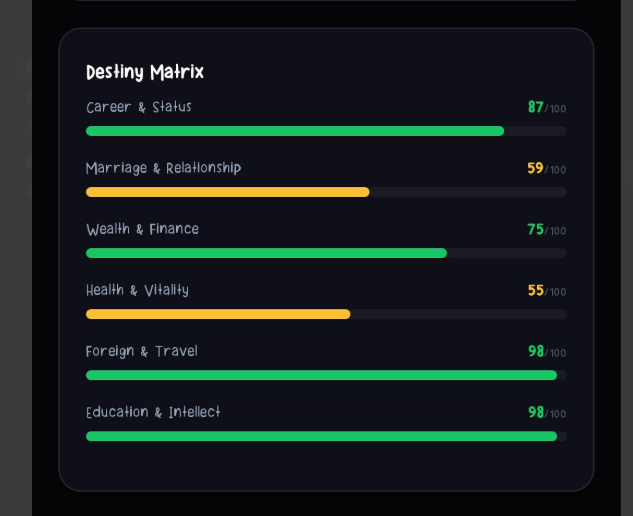 |
| **Planetary Strength** | A 0-100 rating meter for each planet, calculating its functional power based on house placement and motion. | 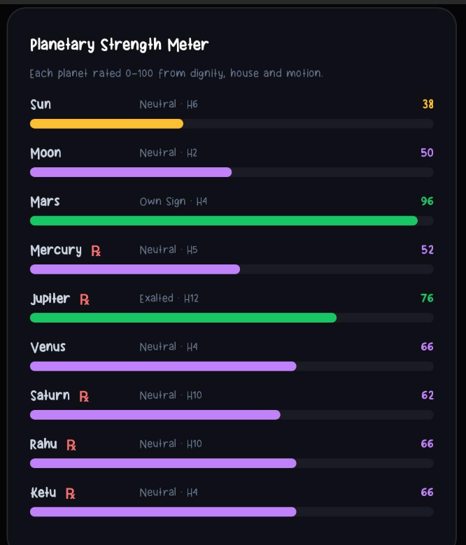 |
| **Planetary Positions** | Side-by-side comparison of Vedic vs Western planetary placements using the Whole-sign house system. | 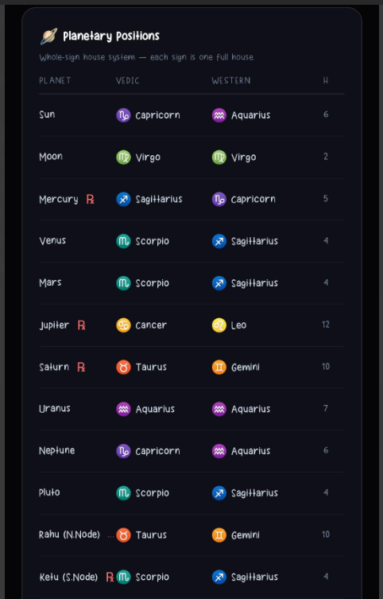 |
| **Dasha Timing** | Detailed breakdown of Mahadasha and Antardasha periods with completion percentages. | 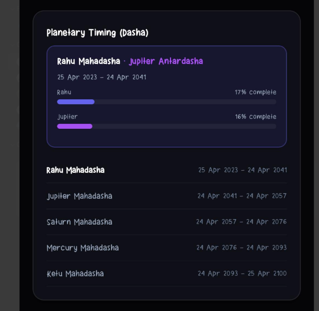 |
| **Dasha Wheel** | A visual donut chart representing your current planetary cycle and upcoming life shifts. | 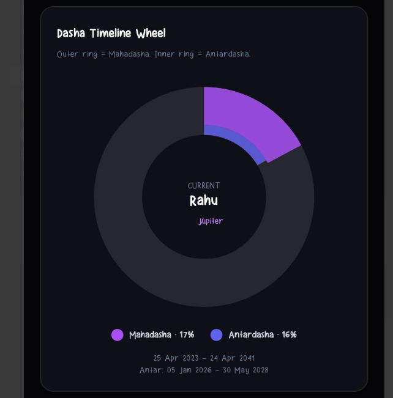 |
| **Ashtakvarga (Sarva)** | A heat-map style wheel identifying fortunate signs based on cumulative planetary bindus. | 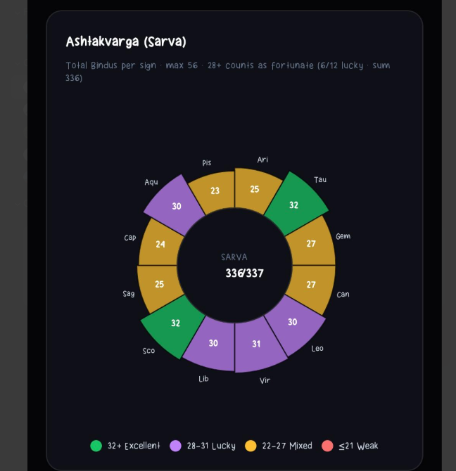 |
| **Daily Guidance** | Transit-mapped guidance for any date, with alignment score, lucky color/number, and Rahu Kaal. | 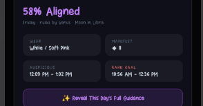 |
| **Timeline Forecast** | AI-driven life predictions mapped against your planetary timeline for maximum context. | 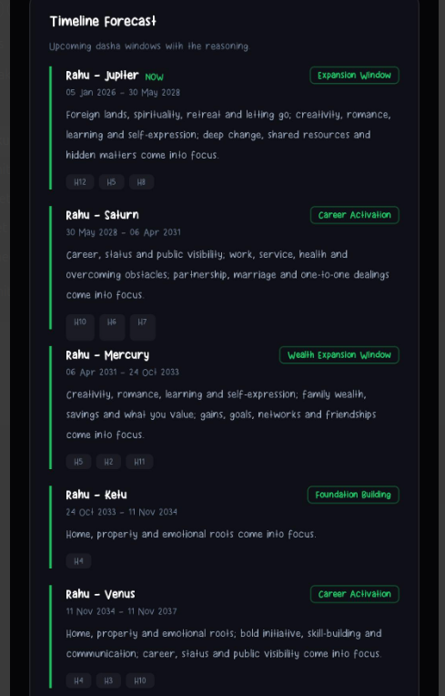 |
| **Prediction Confidence** | Transparency layer showing how many independent chart signatures support each AI-driven theme. | 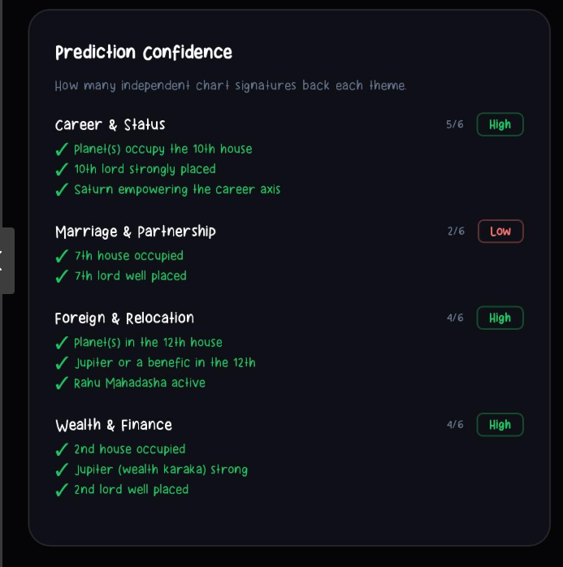 |
| **Current Sky (Gochar)** | Real-time planetary transits relative to your Moon sign, tracking immediate energetic shifts. | 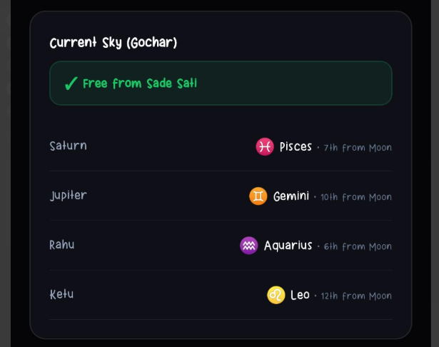 |

---

## Deep Dive: The Science & Soul of the App

This app isn't just a "horoscope generator"; it's a high-precision calculation engine that bridges ancient Vedic wisdom with modern technology. Here is how the data flows from the stars to your screen.

### 1. The Mathematical Foundation (Astronomy Engine)
The journey starts with the `astronomy-engine` library, which provides sub-degree precision for planetary longitudes.
- **Tropical to Sidereal**: We apply the **Lahiri Ayanamsha** (the most accepted standard in Vedic astrology) to shift Western tropical coordinates to the Sidereal (Vedic) zodiac.
- **Whole-Sign Houses**: We use the **Lagna (Ascendant)** as the 1st house. Every subsequent 30-degree sign becomes a full house. This provides a clear, consistent structure for analyzing life areas.

### 2. The Logic Layer (Vedic Math)
Once positions are fixed, the app runs several deterministic algorithms:
- **Planetary Strength (Shadbala-lite)**: Each planet is rated on a 0-100 scale. We look at its **Dignity** (is it exalted, in its own sign, or debilitated?) and its **Angular Strength** (planets in the 1st, 4th, 7th, and 10th houses are naturally more powerful).
  - 
- **Destiny Matrix Scoring**: We calculate scores for 6 life areas (Career, Wealth, etc.) by analyzing the strength of the **House Lord**, the **Karaka** (natural significator), and the presence of any **Benefics** or **Malefics**.
  - 
- **Dasha Timeline**: Using the Moon's exact position at birth, we calculate the **Vimshottari Dasha**—a 120-year planetary cycle that determines the "timing" of your life events.
  - 

### 3. The AI Bridge (Gemini 2.5 Pro)
This is where the math turns into wisdom. We don't send your personal data to the AI; we send the **Calculated Facts** (e.g., "Mars is in the 10th house, strong, ruling the 5th house").
- **The Prompt**: A specialized [Master Astrologer Prompt](backend/src/ai/prompts.js) instructs the AI to use "Cause -> Effect" logic. It doesn't just say "you are lucky"; it says "Because your 9th Lord is exalted, fortune follows your higher learning."
- **Prediction Confidence**: To ensure transparency, the system tracks how many independent "signatures" support a prediction. If three different factors point to a career shift, the confidence is **High**.
  - 

### 4. How to use this in your Life?
- **Planning**: Use the **Dasha Timeline** and **Gochar (Transits)** to know when to push for career growth and when to focus on inner peace.
- **Self-Awareness**: The **Core Identity** and **Personality Matrix** help you understand your natural drives—why you react emotionally or why you are so ambitious.
- **Guidance**: The **Remedies** section provides modern, behavioral actions (like meditation or journaling) to balance planetary energies.

---

## 🧠 The AI Strategy: Right Model for the Right Job

Not every task deserves a flagship model. The backend routes each job to a model tier and an explicit **thinking budget**, then dedupes in-flight to never pay twice for the same answer.

<div align="center">
  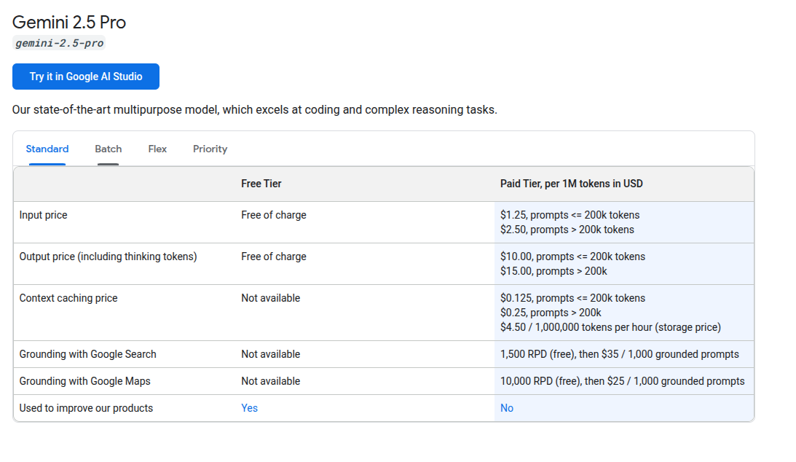
  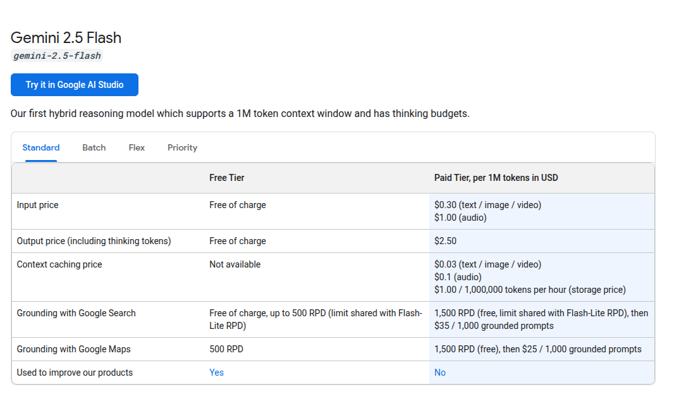
  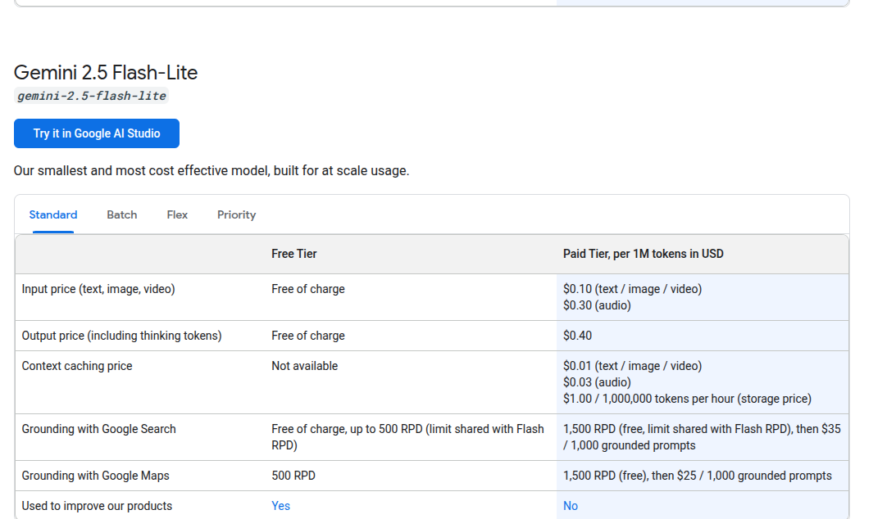
</div>

| Task | Model tier | Thinking budget | Why |
|---|---|---|---|
| **Kundali interpretation** | `gemini-2.5-pro` | 768 | Synthesizes dozens of competing chart factors into one coherent narrative |
| **Palm reading (single & both-hands)** | `gemini-2.5-pro` (Vision) | 512 | Descriptive multimodal analysis of hand lines |
| **Daily guidance** | `gemini-2.5-pro` | 256 | Focused single-day transit reading |
| **Astrologer chat answer** | `gemini-2.5-pro` | 256 | Short, emotionally-aware Vedic responses |
| **Chat topic guard** | `gemini-2.5-flash-lite` | — | One-word ALLOW/BLOCK classification |
| **Palm image gate** | `gemini-2.5-flash` | 0 | Cheap usable/unusable yes-no before any Pro spend |

**Reliability layers around every call** ([`backend/src/ai/gemini.js`](backend/src/ai/gemini.js)):
- **Model fallback chains** — if the primary model is busy, it tries the next in the chain.
- **Retry with exponential backoff** — transient 429/503s retried up to 3× (1s → 2s → 4s).
- **In-flight dedupe** ([`backend/src/ai/dedupe.js`](backend/src/ai/dedupe.js)) — concurrent identical requests (e.g. a double-tap or tab refresh) share one promise instead of firing twice.
- **Persistent caching** — kundali, daily (per date), palm (per image hash), and chat are all stored in MySQL, so a repeat view costs nothing.

---

## 🏛 Architecture & Data Flow

```
                         ┌──────────────────────────┐
                         │   Firebase Phone Auth     │  (OTP → ID token)
                         └─────────────┬────────────┘
                                       │ ID token
   ┌─────────────────┐     ┌───────────▼────────────┐     ┌──────────────────┐
   │  Web (PWA)      │     │   Express 5 API         │     │  Google Gemini    │
   │  React 19 +Vite │◄───►│   • verifies ID token   │◄───►│  2.5 Pro / Flash  │
   │                 │ JWT │   • issues 30d JWT      │     │  (text + vision)  │
   │  astrology.js   │     │   • Zod validation      │     └──────────────────┘
   └─────────────────┘     │   • rate limit + helmet │
                           │   • in-flight dedupe    │     ┌──────────────────┐
   ┌─────────────────┐     │   controller→service→   │◄───►│  OpenStreetMap    │
   │ Mobile (Expo)   │◄───►│        model            │     │  Nominatim (geo)  │
   │ RN 0.81 + RN    │ JWT └───────────┬────────────┘     └──────────────────┘
   │ shared/         │                 │ Sequelize
   │  astrology.js   │     ┌───────────▼────────────┐
   └─────────────────┘     │   MySQL 8               │
                           │  users, kundalis,       │
                           │  daily, chat, palm,     │
                           │  locations, auth        │
                           └─────────────────────────┘
```

**The golden rule:** charts are computed **on the client** (`astrology.js`), and only the resulting **fact sheet** crosses the wire. The backend orchestrates AI, persistence, auth, and geo — it never recomputes the chart.

> ⚠️ **Intentional duplication:** [`frontend/src/astrology.js`](frontend/src/astrology.js) and [`mobile/src/shared/astrology.js`](mobile/src/shared/astrology.js) are ~950-line mirror copies (same for `prompts.js`). **Edit both** until a shared package is extracted. See [CLAUDE.md](CLAUDE.md).

---

## Tech Stack

| Layer | Stack |
|---|---|
| **Frontend** | React 19, Vite 8, React Router 7, TanStack Query 5, vite-plugin-pwa, astronomy-engine, TensorFlow.js + MediaPipe Hands |
| **Mobile** | React Native 0.81, Expo SDK 54, React Navigation 7 (drawer + native-stack), Reanimated 4, expo-image / image-picker / image-manipulator, expo-haptics, expo-blur, expo-updates, expo-location, react-native-svg, TensorFlow.js |
| **Backend** | Node.js 20+, Express 5, Sequelize 6 + MySQL (`mysql2`), Zod, Pino, Helmet, express-rate-limit, Firebase Admin, jsonwebtoken |
| **AI** | Google Gemini 2.5 (`@google/generative-ai`) — Pro for synthesis, Flash/Flash-Lite for gating — text + vision |
| **Geo** | OpenStreetMap Nominatim + `tz-lookup` (IANA timezone), MySQL-cached |
| **Auth** | Firebase Phone Auth (OTP) — client sends ID token, backend verifies + issues JWT |
| **Tooling** | ESLint, Prettier, Husky + lint-staged, Umzug migrations, EAS Build + EAS Update |

---

## Project Structure

```
astrology-ai/
├── backend/
│   ├── migrations/                # Umzug SQL migrations (initial schema, auth/OTP)
│   └── src/
│       ├── ai/                    # gemini.js (client + retry), prompts.js, dedupe.js
│       ├── config/                # envConfig (Zod), dbConfig, firebase, aiConfig, logger
│       ├── controllers/           # thin request handlers per feature
│       ├── errors/                # AppError
│       ├── middleware/            # errorHandler, auth (requireAuth), rateLimit, validate
│       ├── models/                # Sequelize models + index.js associations
│       ├── routes/                # Express routers (auth, kundali, daily, chat, palm, location)
│       ├── services/              # business logic per feature
│       ├── utils/                 # asyncHandler, respond, genId, userKey, cleanJson, imageValidator
│       ├── validators/            # Zod schemas
│       └── server.js              # entry point — sync(), seed, listen, graceful shutdown
├── frontend/
│   └── src/
│       ├── components/            # KundaliChart, DashaWheel, AshtakvargaWheel, DoshaCard, …
│       ├── pages/                 # Home, Reading, Chat, Palm, PalmStep, PalmCompare, Profile
│       ├── features/             # auth/, chat/, kundali/, location/, palm/ (hooks + UI)
│       ├── context/               # ChartContext
│       ├── services/api.js        # backend client (auto-derives base URL)
│       ├── astrology.js           # client-side chart engine (mirror of mobile)
│       └── theme/tokens.js
└── mobile/
    ├── App.js                     # providers + splash gate + auth lifecycle
    ├── app.json                   # Expo config (icon, splash, permissions, OTA)
    ├── eas.json                   # EAS build profiles (development / preview / production)
    └── src/
        ├── features/              # auth, home, reading, palm, kundali, location, chat, profile
        │   ├── reading/sections/  # KundaliTab, PlanetsTab, TimelineTab, ReadingTab, DailyCard
        │   └── palm/sections/     # UploadView, ReadingResult, CompareView, RejectView, …
        ├── components/            # MagicButton, PressableScale, CosmicCard, picker/, SplashScreen
        ├── navigation/            # RootNavigator (Login ↔ Main drawer)
        ├── shared/astrology.js    # mirror of frontend/src/astrology.js
        ├── context/               # ChartContext
        ├── theme/                 # tokens, ThemeContext, useStyles (dark/light)
        └── utils/                 # haptics, compressImage, storage, useBackToKundali
```

> **Note:** `frontend/src/astrology.js` and `mobile/src/shared/astrology.js` are intentional copies. Edits must be applied to both until extracted into a shared package.

---

## Quick Start

### Prerequisites

- **Node.js 20+** (repo pins `20.11.0` via [`.nvmrc`](.nvmrc))
- **MySQL 8+** running locally (or a remote instance)
- A **Google Gemini API key** — get one at https://aistudio.google.com/apikey
- *(Optional)* A **Firebase project** with Phone Auth enabled, for real OTP login

### 1. Clone

```bash
git clone https://github.com/palak-commit/astrology-ai-pro.git
cd astrology-ai-pro
```

### 2. Backend setup

```bash
cd backend
npm install
cp .env.example .env       # then fill in GEMINI_API_KEY + JWT_SECRET + DB credentials
npm run migrate            # create tables
npm run dev                # http://localhost:5000
```

### 3. Frontend setup

In a new terminal:

```bash
cd frontend
npm install
cp .env.example .env       # optional — auto-detects backend in dev
npm run dev                # http://localhost:5173
```

Open http://localhost:5173 in your browser.

### 4. Mobile setup (optional)

In a third terminal:

```bash
cd mobile
npm install
cp .env.example .env       # set EXPO_PUBLIC_API_URL if needed
npx expo start             # opens Metro bundler + QR code
```

Scan the QR code with **Expo Go** (App Store / Play Store) on your phone. The app must be on the same Wi-Fi as the dev machine, or run `npx expo start --tunnel` for cross-network access.

> 💡 Added or moved a file? Restart Metro with `npx expo start --clear` to bust the bundler cache.

---

## Environment Variables

### Backend ([backend/.env.example](backend/.env.example))

| Variable | Required | Default | Description |
|---|---|---|---|
| `GEMINI_API_KEY` | ✅ | — | Google Gemini API key |
| `JWT_SECRET` | ✅ | — | Secret for signing user JWTs (min 16 chars) |
| `PORT` | | `5000` | Backend port |
| `NODE_ENV` | | `development` | `development` / `production` / `test` |
| `CORS_ORIGINS` | prod only | — | Comma-separated allowed origins (permissive localhost/LAN allowlist in dev) |
| `DB_HOST` | | `localhost` | MySQL host |
| `DB_PORT` | | `3306` | MySQL port |
| `DB_USER` | | `root` | MySQL user |
| `DB_PASS` | | `` | MySQL password |
| `DB_NAME` | | `astrology_db` | MySQL database name |
| `JWT_EXPIRES_IN` | | `30d` | JWT lifetime |
| `GOOGLE_MAPS_API_KEY` | | — | Optional; geo falls back to OpenStreetMap Nominatim when unset |
| `FIREBASE_SERVICE_ACCOUNT_B64` | prod | — | Base64-encoded Firebase service-account JSON (preferred in production) |
| `FIREBASE_SERVICE_ACCOUNT_JSON` | dev | — | Raw JSON string of service account (alternative to base64) |

> The backend **fails fast at boot** with a clear, Zod-validated message if anything required is missing. In dev only, a gitignored `backend/src/config/firebase-admin.json` file is the third credential fallback — **never commit it.**

### Frontend ([frontend/.env.example](frontend/.env.example))

| Variable | Description |
|---|---|
| `VITE_API_URL` | Backend API URL. Leave default in dev — the frontend auto-derives it from the page hostname, so opening `http://<pc-ip>:5173` on your phone automatically targets `http://<pc-ip>:5000/api`. |

### Mobile ([mobile/.env.example](mobile/.env.example))

| Variable | Description |
|---|---|
| `EXPO_PUBLIC_API_URL` | Backend API URL (must include `/api` suffix, e.g. `https://your-backend.vercel.app/api`). For EAS builds, also register this in EAS env vars: `eas env:create --environment preview --name EXPO_PUBLIC_API_URL --value <url> --visibility plaintext`. |

---

## API Reference

All routes are mounted under `/api`. Reads are limited to **60 req/min**, writes to **10 req/min**; write bodies are **Zod-validated**.

### Auth
- `POST /api/auth/verify-otp` — verify a Firebase ID token, upsert the account, return a signed JWT
- `POST /api/auth/dummy-login` — phone-only dev login (no SMS), returns JWT + saved birth form
- `GET  /api/auth/me` — current account *(requires `Authorization: Bearer <JWT>`)*

### Kundali
- `GET  /api/interpret` — fetch the saved interpretation for a user
- `POST /api/interpret` — generate a new chart interpretation from a fact sheet

### Palm
- `GET  /api/palm` — latest saved palm reading
- `GET  /api/palm/history` — list past readings (lightweight metadata)
- `GET  /api/palm/:id` — get a specific reading
- `POST /api/palm` — analyze a single palm photo (gate → Pro Vision)
- `POST /api/palm/compare` — Both-Hands "Full Life Comparison" (left + right in one call)

### Daily
- `GET  /api/daily` — saved daily guidance for a date
- `GET  /api/daily-dates` — list dates that already have guidance (for the green dots)
- `POST /api/daily` — generate daily guidance

### Chat
- `GET  /api/chat` — full chat history for a user
- `POST /api/chat` — send a message to the AI astrologer (topic-gated)

### Locations
- `GET  /api/locations/search` — city autocomplete (MySQL cache → Nominatim fallback)
- `GET  /api/locations/details` — resolve a place to coordinates + IANA timezone

### Health
- `GET  /` and `GET /health` — liveness checks

---

## 🗄 Data Model

Sequelize models with associations registered in [`backend/src/models/index.js`](backend/src/models/index.js). User content cascades on delete.

| Model | Purpose | Key fields |
|---|---|---|
| **User** | Identity by birth details (the join key for all readings) | `name`, `gender`, `birthDate`, `birthTime`, `birthCity`, `phone` |
| **AuthAccount** | Firebase login ↔ phone mapping | `firebaseUid` (unique), `phone`, `lastLoginAt` |
| **Kundali** | One saved chart interpretation per user | `chartData` (fact sheet), `interpretation` (JSON) |
| **DailyData** | Daily guidance, one row per user per date | `date`, `guidance` (JSON) |
| **ChatMessage** | Persisted chat turns | `role` (`user`/`assistant`), `content` |
| **PalmReading** | Palm analysis results (no image bytes stored) | `handType`, `imageQuality`, `imageHash` (SHA-256), `reading` (JSON) |
| **Location** | Geocoding + timezone cache | `placeId` (unique), `searchName`, `lat`, `lng`, `tzOffset`, `tzId`, `source` |

```
User ─┬─ hasOne  Kundali
      ├─ hasMany DailyData
      ├─ hasMany ChatMessage
      └─ hasMany PalmReading        AuthAccount (standalone)    Location (cache)
```

> Schema is created by `sequelize.sync()` on boot (non-destructive). Column/shape changes go through **Umzug migrations** in [`backend/migrations/`](backend/migrations/).

---

## Scripts

### Backend

```bash
npm run dev              # nodemon hot reload
npm start                # production
npm run migrate          # apply pending migrations
npm run migrate:down     # roll back last migration
npm run migrate:status   # show migration state
npm run format           # prettier write
```

### Frontend

```bash
npm run dev              # vite dev server
npm run build            # production build → dist/
npm run preview          # preview the build
npm run lint             # eslint
npm run format           # prettier write
```

### Mobile

```bash
npx expo start                                       # local dev (Expo Go)
npx expo start --clear                               # local dev, clears Metro cache
npx expo start --tunnel                              # cross-network dev
eas build --platform android --profile preview       # cloud-build Android APK
eas build --platform ios --profile preview           # cloud-build iOS IPA (needs Apple Developer account)
eas update --branch preview --message "..."          # push JS-only updates to installed APKs (OTA)
eas env:list --environment preview                   # view EAS env vars
```

> **OTA vs. build:** JS/style/asset changes ship instantly with `eas update`. Adding a **native module**, or changing icons/splash/permissions/SDK, requires a fresh `eas build`.

---

## 🏗️ Deployment Architecture

The application uses a modern, decoupled architecture designed for scale and security.

### Backend (API Layer) → Vercel + Railway
- **Compute:** Deployed as serverless functions on **Vercel**. *Root Directory must be set to `backend`* in project settings, and `mysql2` is force-imported in `dbConfig.js` so Vercel's tracer bundles it.
- **Database:** Hosted on **Railway (MySQL 8)** for robust relational integrity with automated backups.
- **Migration:** Run `npm run migrate` via CLI connected to the Railway TCP Proxy to sync schemas — never auto-run on cold starts.

> For a host that runs the Express app exactly as written (persistent connection pools, real `app.listen()`), **Render / Railway / Fly** are smoother fits than serverless.

### Frontend (Web App) → Static Edge Host
- **Hosting:** Fully static deployment to **Vercel / Netlify / Cloudflare Pages**.
- **PWA:** vite-plugin-pwa generates a Service Worker for offline-ready assets, installability, and NetworkFirst caching of already-loaded readings.

### Mobile App (iOS & Android) → EAS Build & Update
- **Builds (APK/IPA):** Handled by **Expo Application Services (EAS Build)** in the cloud.
- **OTA Updates:** `eas update` pushes JS/style/asset changes instantly to the `preview`/`production` channels without an App Store review cycle.

---

## Security Notes

- **Never commit `.env` files or `firebase-admin.json`.** All are gitignored. Use `.env.example` as a template.
- **Never paste secrets into chat, screenshots, or screen shares** — treat them as compromised the moment they leave your terminal. (This repo has leaked a service-account file before; push protection now blocks it.)
- **If a key leaks:**
  - Gemini → rotate at https://aistudio.google.com/apikey (Google often auto-revokes)
  - Firebase service account → Google Cloud Console → IAM → Service Accounts → delete the key + create a new one
  - MySQL → Railway dashboard → regenerate `MYSQL_ROOT_PASSWORD`
- The backend enforces **Helmet** headers, a **CORS** allowlist (strict in production), **Firebase-verified** phone-OTP auth, **JWT** sessions, **Zod** input validation, and per-endpoint **rate limits**.
- Uploaded palm photos are **never stored** — only a SHA-256 hash is kept, for dedupe.
- GitHub secret-scanning is enabled. Pushes containing detected secrets will be blocked.

---

## Troubleshooting

**`AI is busy right now` / `AI_OVERLOADED`** — Usually a transient Gemini rate-limit (the client already retries 3×). If it persists, check backend logs — a 403 means your API key was revoked (leaked or invalid).

**`Invalid environment configuration` at boot** — Read the listed missing keys; copy [backend/.env.example](backend/.env.example) to `.env` and fill required values.

**Backend won't connect to MySQL** — Verify MySQL is running and the `DB_*` vars match your local setup. Run `npm run migrate:status` to confirm DB reachability.

**Phone can't reach dev server** — Make sure both devices are on the same Wi-Fi and access via your PC's LAN IP (e.g. `http://192.168.1.42:5173`), not `localhost`.

**`UnableToResolveError` in Metro after moving files** — Stale bundler cache. Restart with `npx expo start --clear`.

**New native module doesn't appear in the installed APK** — Native modules can't ship over OTA. Run a fresh `eas build`, not `eas update`.

---

## License

ISC © Astrology AI Pro
</content>
</invoke>
